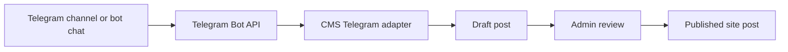
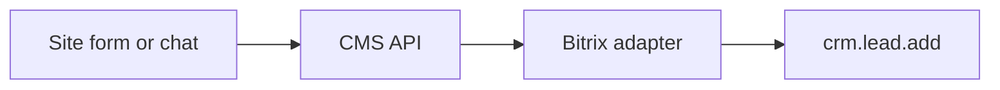

# Архитектура CMS-движка

## Цель

Создать собственный движок для сайтов, который работает как удобная WordPress-подобная админка, но проще расширяется под автоматизацию, интеграции и AI-помощников для клиентских сайтов.

## Базовые модули

### 1. Core CMS

Отвечает за сайты, посты, публикацию, настройки и публичный API.

Текущие сущности:

- `posts` - материалы сайта.
- `sites` - сайты, которые обслуживает движок.
- `events` - журнал действий.

Рабочее хранилище — SQLite (`data/cms.sqlite`). Legacy-файлы `data/*.json` используются только для первичного импорта. Cookie-сессии и хеш пароля администратора также хранятся в SQLite.

Посты могут быть отмечены как `showInSlider`; такие опубликованные материалы попадают в публичный слайдер сайта. Поведение слайдера управляется через `data/settings.json`: скорость автопрокрутки, длительность перехода, точки, кнопки, пауза при наведении и лимит постов.

Будущее расширение:

- страницы;
- меню;
- медиафайлы;
- пользователи и роли;
- темы и шаблоны;
- ревизии контента.

### 2. Admin UI

Готовая панель управления в `public/index.html`. Вход выполняется через `/admin`, редактор страниц доступен авторизованному администратору через `/edit`.

Разделы:

- панель состояния;
- посты;
- интеграции;
- AI-помощник;
- база знаний.
- безопасность и смена пароля администратора.

### 3. Integration Layer

Каждая интеграция должна жить как отдельный adapter:

- `src/integrations/telegram.js`;
- `src/integrations/bitrix.js`;
- будущие: CRM, аналитика, email, формы, платежи.

Единый принцип: адаптер не должен знать про UI. Он получает config и возвращает нормализованные данные.

### 4. Knowledge And Memory

База знаний хранит факты о компании, сайте, услугах, продуктах и правилах коммуникации.

Память хранит долгосрочные проектные решения, предпочтения и контекст клиента.

Текущие источники:

- коллекции `knowledge` и `memory` в `data/cms.sqlite`;
- `knowledge/*.md` для стратегических материалов;
- legacy JSON только для первичной миграции.

### 5. AI Assistant

AI-помощник работает через OpenAI-compatible API:

- OpenAI API;
- OpenRouter;
- локальный gateway;
- fine-tuned model;
- RAG-сервис поверх векторной базы.

Сейчас он берет:

- system prompt из настроек;
- записи knowledge;
- записи memory;
- сообщение клиента.

## Telegram Publishing Flow

Для каналов бот должен быть добавлен в канал. `getUpdates` подходит для старта и теста. Для стабильной работы лучше включить webhook. В настройках Telegram есть режим `autoPublish`: если он включен, импортированные сообщения сразу становятся опубликованными постами. Фото скачиваются в `public/uploads/telegram`; если Telegram присылает альбом, первое фото становится обложкой, остальные открываются в галерее поста.

`POST /api/integrations/telegram/webhook`

## Bitrix Flow

## Production Roadmap

### Phase 1

- Авторизация администратора: готово.
- SQLite и автоматическая миграция JSON: готово.
- Переменные окружения для секретов: готово.
- Webhook setup screen для Telegram.

### Phase 2

- Мультисайтовость.
- Темы и шаблоны.
- Медиа-библиотека.
- Роли: owner, editor, integrator.

### Phase 3

- Очереди задач.
- Векторная база знаний.
- AI training/fine-tuning pipeline.
- Plugin marketplace для интеграций.
